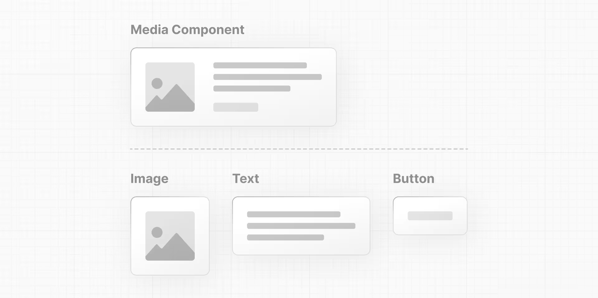
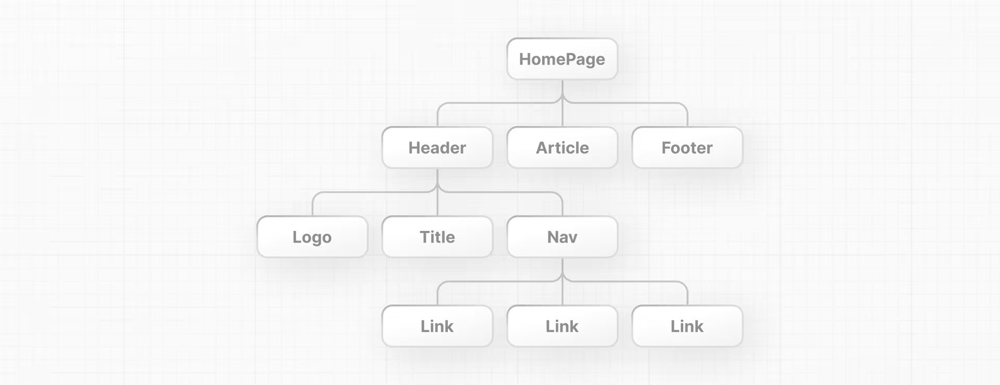

# ComponentsでUIを構築する
## Reactのコンセプト
Reactアプリケーションを作り始めるには、Reactの3つのコア・コンセプトに精通している必要がある。それは以下の3つです：

- Components
- Props
- State

次の章では、これらの概念について説明し、引き続き学習できるリソースを提供します。これらの概念に慣れたら、Next.jsをインストールし、サーバーコンポーネントやクライアントコンポーネントなどの新しいReact機能を使用する方法を紹介します。

## Components
ユーザー インターフェイスは、**Components**と呼ばれる小さな構成要素に分解できます。

コンポーネントによって、自己完結的で再利用可能なコードの断片を構築することができます。コンポーネントを **LEGOブロック**と考えると、これらの個々のレンガを組み合わせて、より大きな構造を形成することができます。UIの一部を更新する必要がある場合は、特定のコンポーネントまたはレンガを更新できます。
<p aling="center">
    
</p>
このモジュール性により、アプリケーションの残りの部分に触れることなくコンポーネントを追加、更新、削除することができるため、コードが大きくなっても保守しやすくなる。

Reactコンポーネントのいいところは、単なるJavaScriptであることだ。JavaScriptの視点から、Reactコンポーネントの書き方を見てみよう：

### コンポーネントの作成
Reactでは、**コンポーネントは関数**です。 `script`タグの中に、`header`という新しい関数を作成します：
```index.html
<script type="text/jsx">
  const app = document.getElementById('app');
 
  function header() {}
 
  const root = ReactDOM.createRoot(app);
  root.render(<h1>Develop. Preview. Ship.</h1>);
</script>
```
コンポーネントとは、*UI要素*を返す関数のことです。関数のreturn文の中に、JSXを書くことができます：
```index.html
<script type="text/jsx">
  const app = document.getElementById('app');
 
  function header() {
    return <h1>Develop. Preview. Ship.</h1>;
  }
 
  const root = ReactDOM.createRoot(app);
  root.render(<h1>Develop. Preview. Ship.</h1>);
</script>
```
このコンポーネントをDOMにレンダリングするには、`root.render()`メソッドの第1引数に渡します：
```index.html
<script type="text/jsx">
  const app = document.getElementById('app');
 
  function header() {
    return <h1>Develop. Preview. Ship.</h1>;
  }
 
  const root = ReactDOM.createRoot(app);
  root.render(header);
</script>
```
しかし、ちょっと待ってほしい。上のコードをブラウザで実行しようとすると、エラーが出る。これを動作させるには、やらなければならないことが2つある：

まず、Reactコンポーネントは、プレーンなHTMLやJavaScriptと区別するために、大文字で表記すべきである：
```index.html
function Header() {
  return <h1>Develop. Preview. Ship.</h1>;
}
 
const root = ReactDOM.createRoot(app);
// Capitalize the React Component
root.render(Header);
```
第二に、Reactコンポーネントは、通常のHTMLタグと同じように、角括弧<>を使って使用する：
```index.html
function Header() {
  return <h1>Develop. Preview. Ship.</h1>;
}
 
const root = ReactDOM.createRoot(app);
root.render(<Header />);
```
もう一度ブラウザでコードを実行してみると、変更内容が表示されます。
### コンポーネントを入れ子にする
アプリケーションには通常、単一のコンポーネントよりも多くのコンテンツが含まれます。通常のHTML要素のように、ネスト Reactコンポーネントを互いに入れ子にすることができます。

この例では、`HomePage`という新しいコンポーネントを作成します：
```index.html
function Header() {
  return <h1>Develop. Preview. Ship.</h1>;
}
 
function HomePage() {
  return <div></div>;
}
 
const root = ReactDOM.createRoot(app);
root.render(<Header />);
```
そして、`<Header>`コンポーネントを新しい`<HomePage>`コンポーネントの中に入れ子にします：
```index.html
function Header() {
  return <h1>Develop. Preview. Ship.</h1>;
}
 
function HomePage() {
  return (
    <div>
      {/* Nesting the Header component */}
      <Header />
    </div>
  );
}
 
const root = ReactDOM.createRoot(app);
root.render(<Header />);
```
### コンポーネント・ツリー
このようにReactコンポーネントをネストし続けることで、コンポーネント・ツリーを形成することができる。
<p aling="center">
    
</p>
例えば、トップレベルの`HomePage`コンポーネントは、`Header`、`Article`、`Footer`コンポーネントを保持することができます。そして、これらのコンポーネントはそれぞれ子コンポーネントを持つことができます。例えば、`Header`コンポーネントは、`Logo`、`Title`、`Nav`コンポーネントを含むことができます。

このモジュール形式により、アプリ内のさまざまな場所でコンポーネントを再利用できる。

プロジェクトでは、`<HomePage>`がトップレベルのコンポーネントになっているので、`root.render()`メソッドに渡すことができます：
```index.html
function Header() {
  return <h1>Develop. Preview. Ship.</h1>;
}

function HomePage() {
  return (
    <div>
      <Header />
    </div>
  );
}
 
const root = ReactDOM.createRoot(app);
root.render(<HomePage />);
```