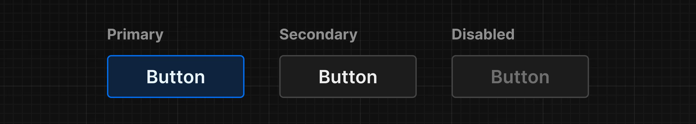

# Propsを使ってデータを表示する
これまでのところ、`<Header />` コンポーネントを再利用すると、どちらも同じ内容が表示されます。
```index.html
function Header() {
  return <h1>Develop. Preview. Ship.</h1>;
}
 
function HomePage() {
  return (
    <div>
      <Header />
      <Header />
    </div>
  );
}
```
しかし、異なるテキストを渡したい場合や、外部ソースからデータをフェッチしているため事前に情報がわからない場合はどうすればいいのだろうか？

通常のHTML要素には属性があり、その属性を使って要素の動作を変える情報を渡すことができます。例えば、``要素の`src`属性を変更すると、表示される画像が変わります。`<a>`タグの`href`属性を変更すると、リンク先が変わります。

同じように、情報の断片をプロパティとしてReactコンポーネントに渡すことができる。これを小道具と呼ぶ。例えば、ボタンのバリエーションを考えてみましょう：
<p aling="center">
    
</p>
JavaScriptの関数と同様に、コンポーネントの動作や画面にレンダリングされたときに表示される内容を変更するカスタム引数（またはprops）を受け付けるコンポーネントを設計できます。そして、これらのpropsを親コンポーネントから子コンポーネントに渡すことができます。

> [!NOTE]
> Reactでは、データはコンポーネントツリーを流れていきます。これは一方向データフローと呼ばれます。次の章で説明するステートは、propsとして親コンポーネントから子コンポーネントに渡すことができます。
## Propsを使う
`HomePage`コンポーネントでは、HTML属性を渡すのと同じように、カスタム`title`プロパティを`Header`コンポーネントに渡すことができます：
```index.html
function HomePage() {
  return (
    <div>
      <Header title="React" />
    </div>
  );
}
```
そして、子コンポーネントである`ヘッダー`は、最初の関数パラメータとしてこれらのプロップを受け取ることができます：
```index.html
function Header(props) {
  return <h1>Develop. Preview. Ship.</h1>;
}
```
`console.log()`プロパティを見ると、`title`プロパティを持つ**オブジェクト**であることがわかります。
```index.html
function Header(props) {
  console.log(props); // { title: "React" }
  return <h1>Develop. Preview. Ship.</h1>;
}
```
propsはオブジェクトなので、オブジェクトのデストラクチャリングを使って、関数のパラメータ内でpropsの値を明示的に指定することができます：
```index.html
function Header({ title }) {
  console.log(title); // "React"
  return <h1>Develop. Preview. Ship.</h1>;
}
```
そして、`<h1>`タグの内容をタイトル変数に置き換えることができます。
```index.html
function Header({ title }) {
  console.log(title);
  return <h1>title</h1>;
}
```
ブラウザでファイルを開くと、「title」という実際の単語が表示されているのがわかるだろう。これは、Reactが、あなたがプレーン・テキスト文字列をDOMにレンダリングしようとしていると考えているためだ。

Reactに、これがJavaScriptの変数であることを伝える方法が必要だ。
## JSXで変数を使う
titleプロップを使用するには、中括弧 {}を追加します。これらは特別なJSX構文で、JSXマークアップの中に通常のJavaScriptを直接書くことができます。
```index.html
function Header({ title }) {
  console.log(title);
  return <h1>{title}</h1>;
}
```
中括弧は、「JSXランド」にいる間に「JavaScriptランド」に入る方法だと考えることができます。中括弧の中には、任意の**JavaScript式**（単一の値として評価されるもの）を追加できます。例えば

1. ドット記法の**オブジェクト・プロパティ**：
```example.js
function Header(props) {
  return <h1>{props.title}</h1>;
}
```
2. **テンプレート・リテラル**:
```example.js
function Header({ title }) {
  return <h1>{`Cool ${title}`}</h1>;
}
```
3. 関数の戻り値:
```example.js
function createTitle(title) {
  if (title) {
    return title;
  } else {
    return 'Default title';
  }
}
 
function Header({ title }) {
  return <h1>{createTitle(title)}</h1>;
}
```
4. あるいは**三項演算子**:
```example.js
function Header({ title }) {
  return <h1>{title ? title : 'Default Title'}</h1>;
}
```
三項演算子を使用した場合、コンポーネントのデフォルトのケースを考慮したため、タイトルプロパに文字列を渡す必要はありません：
```example.js
function Header({ title }) {
  return <h1>{title ? title : 'Default title'}</h1>;
}
 
function HomePage() {
  return (
    <div>
      <Header />
    </div>
  );
}
```
コンポーネントは、アプリケーションのさまざまな部分で再利用できる一般的なタイトルのプロパティを受け入れるようになりました。必要なのはタイトルの文字列を変更することだけです：
```index.html
function HomePage() {
  return (
    <div>
      <Header title="React" />
      <Header title="A new title" />
    </div>
  );
}
```
## リストを繰り返し処理する
リストとして表示する必要のあるデータがあることはよくあることです。配列メソッドを使用してデータを操作し、同じスタイルで異なる情報を保持するUI要素を生成することができます。

以下の名前の配列を`HomePage`コンポーネントに追加します：
```index.html
function HomePage() {
  const names = ['Ada Lovelace', 'Grace Hopper', 'Margaret Hamilton'];
 
  return (
    <div>
      <Header title="Develop. Preview. Ship." />
      <ul>
        {names.map((name) => (
          <li>{name}</li>
        ))}
      </ul>
    </div>
  );
}
```
そして、`array.map()`メソッドを使って配列を繰り返し処理し、**arrow関数**を使って名前をリスト項目にマッピングします：
```index.html
function HomePage() {
  const names = ['Ada Lovelace', 'Grace Hopper', 'Margaret Hamilton'];
 
  return (
    <div>
      <Header title="Develop. Preview. Ship." />
      <ul>
        {names.map((name) => (
          <li>{name}</li>
        ))}
      </ul>
    </div>
  );
}
```
中括弧を使って「JavaScript」と「JSX」の土地を出たり入ったりしていることに注目してほしい。

このコードを実行すると、Reactは`key`プロップが見つからないという警告を出します。これは、ReactがDOM内のどの要素を更新すべきかを知るために、配列内のアイテムを一意に識別する何かが必要だからです。

現在のところ一意であるため、この名前を使用することもできますが、アイテムIDのように一意であることが保証されたものを使用することをお勧めします。
```index.html
function HomePage() {
  const names = ['Ada Lovelace', 'Grace Hopper', 'Margaret Hamilton'];
 
  return (
    <div>
      <Header title="Develop. Preview. Ship." />
      <ul>
        {names.map((name) => (
          <li key={name}>{name}</li>
        ))}
      </ul>
    </div>
  );
}
```

> [!TIP]
> Tips

> [!IMPORTANT]
> 重要

> [!WARNING]
> 警告

> [!CAUTION]
> より強い警告